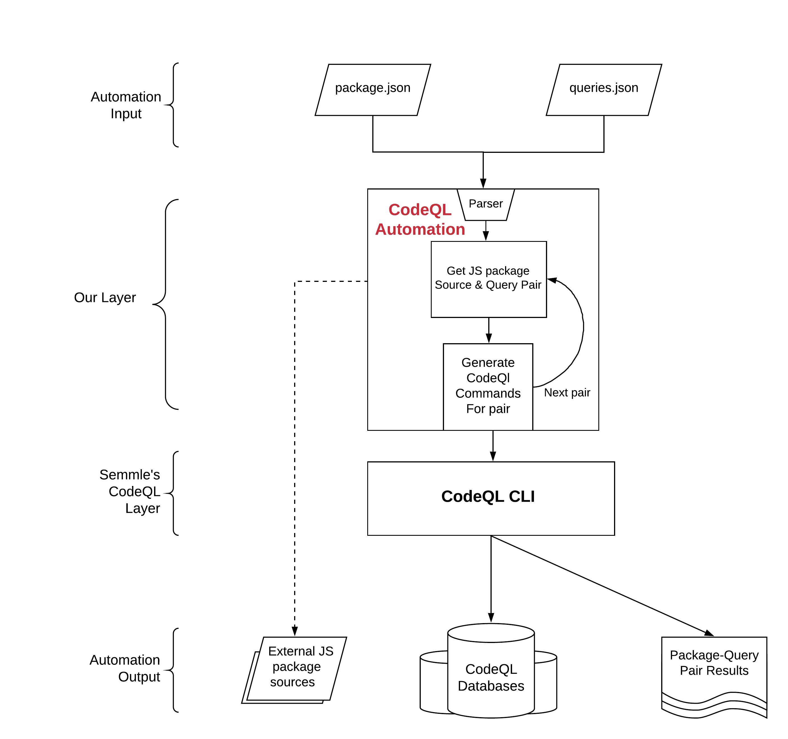

# LGTM++ 

## Description
The purpose of LGTM++ is to better utilize the [CodeQL query language](https://help.semmle.com/QL/learn-ql/introduction-to-ql.html) to better analyze JavaScript source code for vulnerablities particularly pertaining to Code Injection, SQL Injection and OS injection. The primary uses of LGTM++ is automation of the [CodeQL Query Analysis process](https://help.semmle.com/codeql/codeql-cli.html) The queries developed by our group is located in [OSC_CodeQueries directory](https://github.com/OSC-Project/OSC-Code/tree/master/Tools/LGTM/OSC_CodeQueries)   
Last Update: 05/10/2020

## Build
CodeQL Command-Line toolchain version: 2.0.4.  
NodeJS Version: V10.15.2  
NPM Version: 6.4.1  
Operating System: Windows 10, MacOS Catalina, Linux  (was developed on Windows 10)  

## User Guide

### Installation
The automation itself does not require any installations but depends on certain software to be downloaded for usage. LGTM++ assumes that CodeQL CLI installed, if it is not, see [Getting Started with CodeQL CLI](https://help.semmle.com/codeql/codeql-cli/procedures/get-started.html)    
This guide assumes that NodeJS and NPM are installed, for further help on installing please see [Downloading and installing Node.js and npm](https://docs.npmjs.com/downloading-and-installing-node-js-and-npm)

### Usage 
There are various way to run the automation for different scenarios. Here is an explaination of each. For further explaination on how the automation works, see design specs subsection. 

1. To run Automation on a single package with a single query:
> `python CodeQL_Automation.py package1.0.0 myquery.ql`

Additional notes: JavaScript package is not required to be installed or packed locally prior to running. If you already have the source code see scenario 4.    

2. To Run Automation on multiple packages with multiple queries:
> `python CodeQL_Automation.py packageExample.json queriesExample.json` 

Additional notes: See packagesExample.json and queriesExample.json to see the designated format that the automation accepts. 

3. To remove Databases, source code and other miscellaneous files after running:
> `python CodeQL_Automation.py clean`

Additional notes: This is useful when you want to remove databases and downloaded source code before pushing into the repository. This command will not delete results from queries. WARNING: This command will delete the folders that scenario 4 makes, do not keep your original source code in ext_JS_src, instead put a copy of the source code into that directory.   

4. To set up directory structure that the automation uses:
> `python CodeQL_Automation.py setup`

Additional notes: This is useful when you want to have the file directory structure that the automation uses without running any queries on any packages. This process happens automatically in scenario 1 and scenario 2.  

## Files
CodeQl_Automation.py - Script that is used for automation of CodeQL CLI.  
LGTM_Commands.txt - Cheatsheet for running CodeQL CLI manually.  
ql - Directory of Semmle's git clone of [QL repository](https://github.com/github/codeql), contains assets that CodeQL and LGTM uses when making databases and compiling queries.  
OSC_CodeQueries - Directory that contains Queries that our group has made.  
Query_Results - Directory that contains results of package and query pairs.  
packageExample.json - An example of how to format json file for running on multiples packages.  
queriesExample.json - An example of how to format json file for running with multiples queries.

## Design Specs 

The three folders that are created after initally running the automation are the following.  

ext_JS_src - Directory that contains external JavaScript source code.  
DB_Storage - Directory that contains CodeQL Databases that are constructed from the CodeQL CLI  
Query_Results - Directory that contains results of package and query pairs.

## Known Issues 
For Mac Users, If automation crashes because CodeQL CLI returns a non zero in attempting to run query. 
1. Make sure the query exists in OSC_CodeQueries
2. If you are runnning MacOS, go into [OSC_CodeQueries directory](https://github.com/OSC-Project/OSC-Code/tree/master/Tools/LGTM/OSC_CodeQueries) and change the "/" to "\\" in the qlpack.yml file then it should fix issues 
3. Verify that you can run CodeQL CLI  

For Windows 10 Users, If CodeQL is not a recognized command, edit your environment variables and add ql repo to your build path. If you do not know how to do this please see [Add to PATH on Windows 10](https://www.architectryan.com/2018/03/17/add-to-the-path-on-windows-10/)  

Issues when running with clean argument twice.

## Contact
* Kerwin Mercado (Kerwin.mercado@uconn.edu)
* Ahmad Jbara (ahmadjbara@gmail.com)

